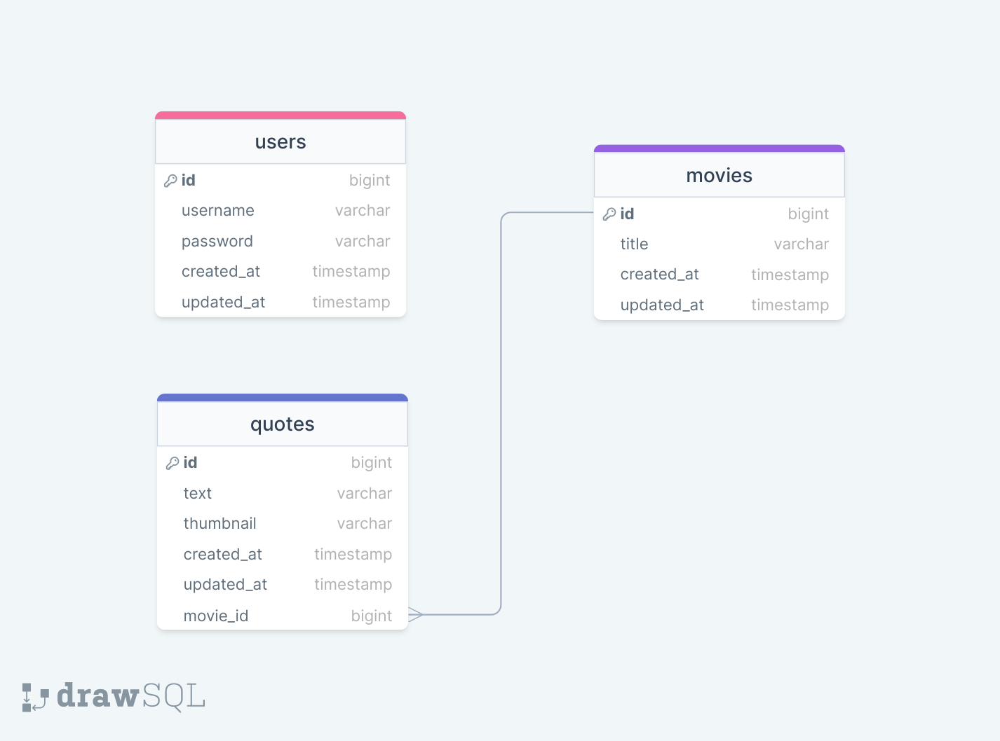

<div style="display:flex; align-items: center">

  <h1 style="position:relative; top: -6px" >Movie Quotes APP</h1>
</div>

---

Movie Quotes app with random quote on the main page, movie page where you can view all qoutes associated with the movie and the admin panel, where you can do CRUD operations on quotes and movies

#

### Table of Contents

-   [Prerequisites](#prerequisites)
-   [Tech Stack](#tech-stack)
-   [Getting Started](#getting-started)
-   [Development](#development)
-   [Project Structure](#project-structure)
-   [Structure Of MySQL](#structure-of-mysql)
-   [Project Structure](#project-structure)
-   [Resources](#resources)

#

### Prerequisites

-    *PHP@7.2 and up*
-    _MYSQL@8 and up_
-    _npm@6 and up_
-    _composer@2 and up_

#

### Tech Stack

-    [Laravel@6.x](https://laravel.com/docs/6.x) - back-end framework
-    [Spatie Translatable](https://github.com/spatie/laravel-translatable) - package for translation
-    [Vite](https://vitejs.dev/guide/) - build tool
-    [Tailwind](https://tailwindcss.com/docs/installation) - CSS framework

#

### Getting Started

1\. First of all you need to clone Movie Quotes from github:

```sh
git clone git@https://github.com/RedberryInternship/niko-shervashidze-movie-quotes
```

2\. Next step requires you to run _composer install_ in order to install all the dependencies.

```sh
composer install
```

3\. after you have installed all the PHP dependencies, it's time to install all the JS dependencies:

```sh
npm install
```

and also:

```sh
npm run dev
```

in order to build your JS/SaaS resources.

4\. Now we need to set our env file. Go to the root of your project and execute this command.

```sh
cp .env.example .env
```

And now you should provide **.env** file all the necessary environment variables:

#

**MYSQL:**

> DB_CONNECTION=mysql
> DB_HOST=127.0.0.1
> DB_PORT=3306
> DB_DATABASE=**\***
> DB_USERNAME=**\***
> DB_PASSWORD=**\***

#

5\. Now execute in the root of you project following:

```sh
  php artisan key:generate
```

Which generates auth key.

6\. If you've completed everything so far, then migrating database if fairly simple process, just execute:

```sh
php artisan migrate
```

##### Now, you should be good to go!

#

### Development

You can run Laravel's built-in development server by executing:

```sh
  php artisan serve
```

if you wish to see changes after changing styles with Tailwind CSS, execute:

```sh
  npm run dev
```

#

### Project Structure

```bash
├─── app
│   ├─── Console
│   ├─── Exceptions
│   ├─── Http
│   ├─── Models
│   ├─── Providers
├─── bootstrap
├─── config
├─── database
├─── languages
│   ├─── en
│   ├─── ka
├─── packages
├─── public
├─── resources
├─── routes
├─── scripts
├─── storage
├─── tests
- .env
- artisan
- composer.json
- package.json
- phpunit.xml
```

#

### Structure of mysql



#

### Resources

-   [Application Design](https://www.figma.com/file/IIJOKK5esgM8uK8pM3D59J/Movie-Quotes?node-id=0%3A1)
-   [Commit message naming conventions](https://redberry.gitbook.io/resources/other/git-is-semantikuri-komitebi)
-   [Project Specifications](https://redberry.gitbook.io/assignment-i-movie-quotes)
